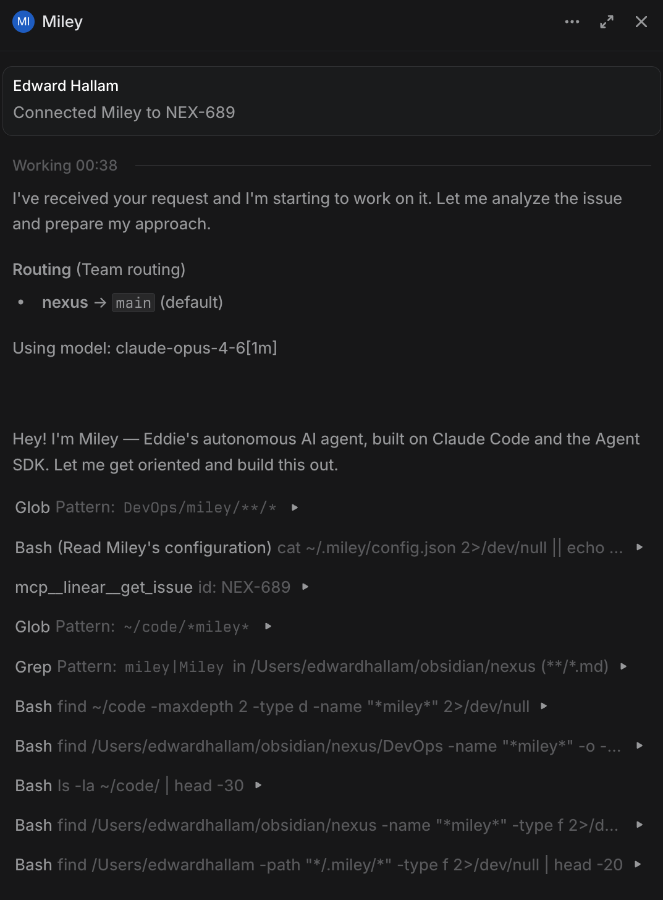

# Miley

A Claude Code agent for [Linear](https://linear.app). Assign an issue, get an autonomous development session.

Miley watches your Linear workspace for issue assignments, spins up isolated git worktrees, and launches Claude Code sessions that work the issue end-to-end — reading your CLAUDE.md, using your skills, and streaming progress back to Linear as it goes.



## Why Miley

Miley was built for how Claude Code actually works today: 1M token context windows, native skill invocation, and CLAUDE.md-driven behavior.

- **You control the agent with CLAUDE.md and skills** — Your repo's CLAUDE.md _is_ the agent's playbook.
- **Session resume** — when a new session starts for an issue that had a previous session, Claude picks up with full conversation history. No lost context, no repeated work.
- **Issue isolation** — every issue gets its own git worktree. Parallel issues never collide.
- **Interactive loop** — Claude can pause and ask you questions via Linear comments, then resume with your answer.
- **Live activity streaming** — watch Claude's thoughts and actions in real-time on the Linear issue.
- **Hot-reload config** — add repos, change settings, adjust instructions. No restart needed.

## How It Works

```
Linear issue assigned
  → Miley receives webhook
  → Routes to the right repository (by team key, label, or project)
  → Creates/reuses a git worktree for the issue
  → Builds a prompt from the issue + your appendInstruction
  → Launches a Claude Code session (with your skills and CLAUDE.md)
  → Streams activity back to the Linear issue
```

## Quick Start

### 1. Install and build

```bash
git clone https://github.com/edwardhallam/miley.git
cd miley
pnpm install
pnpm -r build
```

### 2. Configure

Create `~/.miley/config.json`:

```json
{
  "server": {
    "port": 3457,
    "host": "0.0.0.0"
  },
  "linear": {
    "token": "lin_api_...",
    "workspaceId": "your-workspace-uuid",
    "workspaceName": "your-workspace"
  },
  "repositories": [
    {
      "id": "my-project",
      "name": "my-project",
      "repositoryPath": "~/code/my-project",
      "baseBranch": "main",
      "teamKeys": ["PROJ"],
      "routingLabels": ["Miley"],
      "appendInstruction": "Follow the CLAUDE.md in the repository root."
    }
  ]
}
```

Create `~/.miley/.env`:

```bash
ANTHROPIC_API_KEY=sk-ant-...
LINEAR_API_KEY=lin_api_...
GITHUB_TOKEN=ghp_...

# Optional
MILEY_API_KEY=your-api-key-for-config-endpoints
CLOUDFLARE_TOKEN=your-tunnel-token
MILEY_LOG_LEVEL=INFO
```

### 3. Expose the webhook

Miley needs to receive Linear webhooks. Use a Cloudflare Tunnel, ngrok, or any reverse proxy to expose port 3457.

### 4. Run

```bash
node apps/cli/dist/src/app.js
```

Or set up as a system service (launchd, systemd, etc.).

## Configuration

### Repository Routing

When an issue is assigned, Miley determines the target repository by checking (in order):

1. `[repo=name]` tag in the issue description (explicit override)
2. `routingLabels` — matches the issue's Linear labels
3. `teamKeys` — matches the issue identifier prefix (e.g., `NEX-123` matches `["NEX"]`)
4. `projectKeys` — matches the issue's Linear project

### appendInstruction

The primary way to give Claude repo-specific context beyond CLAUDE.md. Injected into the prompt as:

```xml
<repository-specific-instruction repository="my-project">
Your appendInstruction text here.
</repository-specific-instruction>
```

### Repository Config Reference

| Field | Type | Description |
|-------|------|-------------|
| `id` | string | Unique identifier |
| `name` | string | Human-readable name |
| `repositoryPath` | string | Absolute path (supports `~`) |
| `baseBranch` | string | Default branch for worktree creation |
| `githubUrl` | string | GitHub URL for PR operations |
| `preferLocalBranch` | boolean | Branch in-place instead of worktree (default: `false`) |
| `teamKeys` | string[] | Linear team prefixes for routing |
| `routingLabels` | string[] | Linear labels that route here |
| `projectKeys` | string[] | Linear project keys for routing |
| `appendInstruction` | string | Extra instructions injected into prompts |
| `allowedTools` | string[] | Tools permitted for this repo |
| `disallowedTools` | string[] | Tools blocked for this repo |
| `mcpConfigPath` | string/string[] | Path(s) to `.mcp.json` files |
| `model` | string | Per-repo Claude model override |
| `isActive` | boolean | Enable/disable the repo |
| `userAccessControl` | object | Per-repo user whitelist/blacklist |

### Global Config Reference

| Field | Type | Description |
|-------|------|-------------|
| `server` | object | `port` and `host` for the webhook server |
| `linear` | object | `token`, `workspaceId`, `workspaceName` |
| `repositories` | array | Repository configurations |
| `defaultRunner` | string | Runner type (default: `"claude"`) |
| `claudeDefaultModel` | string | Default Claude model |
| `defaultAllowedTools` | string[] | Tools allowed across all repos |
| `defaultDisallowedTools` | string[] | Tools blocked across all repos |
| `global_setup_script` | string | Script run in new worktrees |
| `userAccessControl` | object | Global user whitelist/blacklist |

## Monorepo Structure

| Package | Purpose |
|---------|---------|
| `apps/cli` | CLI application — bootstrap, config loading, service wiring |
| `packages/core` | Shared types, Zod schemas, session management, persistence |
| `packages/edge-worker` | Core orchestration — webhooks, session lifecycle, git worktrees, prompt assembly |
| `packages/claude-runner` | Claude Code SDK wrapper — session creation, env management, plugin loading |
| `packages/linear-event-transport` | Linear webhook receiving, OAuth token management |
| `packages/config-updater` | HTTP API for remote config updates |

## Development

```bash
pnpm install          # install dependencies
pnpm -r build         # build all packages
pnpm -r test          # run tests
pnpm typecheck        # type checking
pnpm lint             # lint (biome)
pnpm dev              # development mode (watch)
```

Pre-commit hooks run biome lint + typecheck via Husky.

## Upstream

Miley is a fork of [Cyrus](https://github.com/ceedaragents/cyrus) by [Ceedar](https://ceedaragents.com) (Apache 2.0). Cyrus is a multi-runner agent framework with classification, procedures, and support for Gemini, Codex, and Cursor. Miley strips that machinery in favor of Claude Code's native capabilities. See [NOTICE](NOTICE) for attribution.

## License

Apache 2.0 — see [LICENSE](LICENSE).
